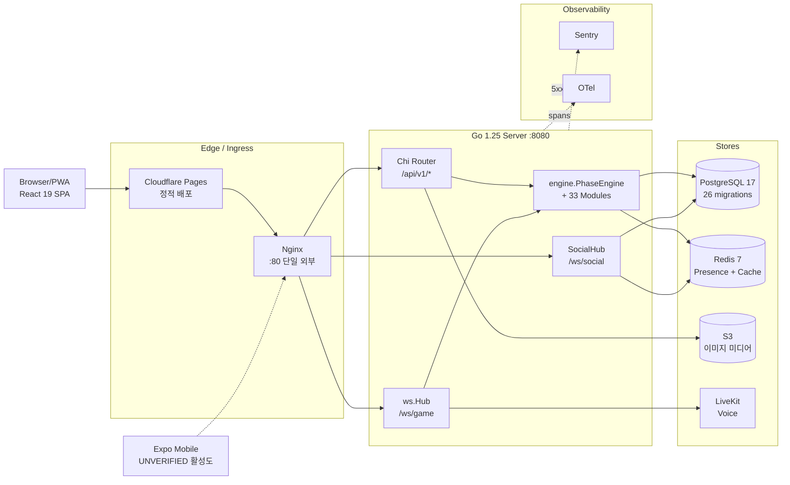
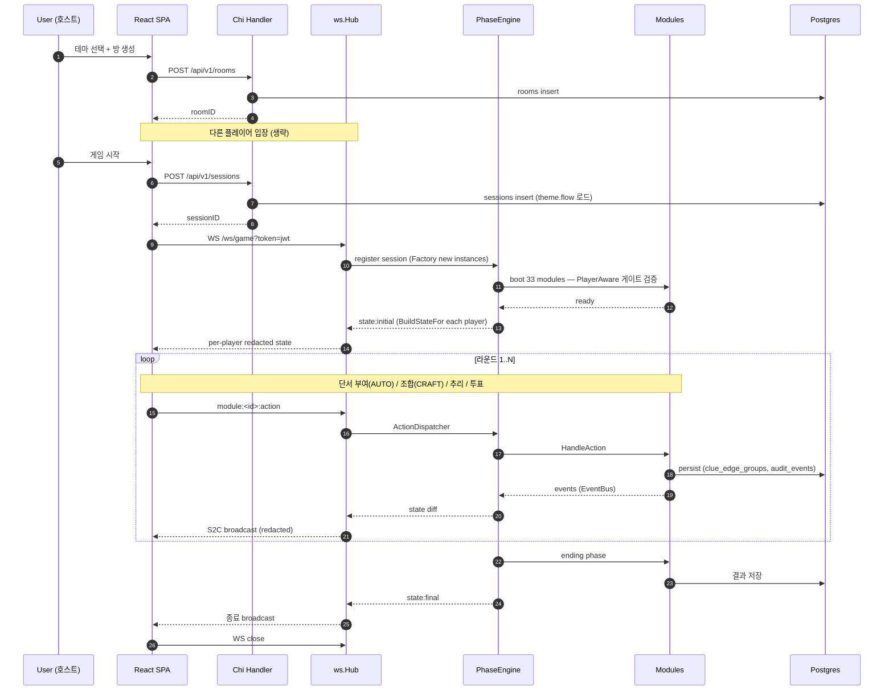

# 01. System Overview

## 한 단락 요약 {#tldr}

**MMP v3** (Murder Mystery Platform v3)는 다중 테마 실시간 멀티플레이어 머더미스터리 게임 플랫폼이다. 호스트 1명 + 플레이어 N명이 한 세션을 진행하며, 라운드별로 단서·장소·메타포가 분기·해석되어 범인을 추리한다. 백엔드는 Go 1.25 단일 바이너리 모놀리스(Chi + gorilla/websocket + sqlc/pgx + go-redis), 프론트는 React 19 SPA(Vite + Zustand + Tailwind 4 + lucide-react). PostgreSQL이 영구 저장소, Redis가 휘발성·실시간(Presence). 게임 로직은 33개 모듈(8 카테고리)로 모듈화되며, 모든 모듈은 PlayerAware 게이트로 per-player 정보 redaction을 강제한다. SSR 없음, Cloudflare Pages 정적 배포 + K8s 1 Deployment 전제. v2(Node.js + Socket.IO + Prisma + Next.js)에서 전면 리빌드.

## 시스템 컨텍스트 다이어그램 {#context}

## 핵심 도메인 흐름 — 게임 1판 {#flow}

## 핵심 도메인 어휘 (요약) {#core-terms}

> 자세한 정의는 `11-glossary.md`.

- **세션 (Session)**: 한 판의 게임. UUID `session_id`.
- **테마 (Theme)**: 시나리오 템플릿. 에디터에서 작성.
- **라운드 (Round)**: 단서·장소가 분기되는 진행 단위.
- **단서 (Clue)**: AUTO(자동 부여) vs CRAFT(조합 생성). DAG `clue_edge_groups`로 관계 표현.
- **모듈 (Module)**: 게임 기능 단위. 33개. PhaseAction 12종으로 동작.
- **PhaseAction**: 모듈에 발송되는 선언적 명령(configJson.phases).
- **PlayerAware 게이트**: 모든 모듈에 per-player redaction 또는 PublicStateMarker 강제.

## 핵심 설계 결정 (Why) {#decisions}

> 자세한 폐기 결정은 `10-history-summary.md`.

| 결정 | 이유 |
|---|---|
| Go 모놀리스 (vs Node.js v2) | goroutine 동시성, 10× WS 처리, 15MB 바이너리 |
| React + Vite SPA (vs Next.js v2) | SSR 0개, CDN 정적 배포 충분, 빌드/배포 단순화 |
| 동적 PhaseEngine (vs 고정 FSM) | 시나리오 분기 표현력 — 3 Strategy(Script/Hybrid/Event) |
| Factory 모듈 (vs 싱글턴) | v2 세션간 상태 누수 버그 해결 |
| sqlc + pgx (vs ORM) | SQL→타입 자동 생성, 제로 오버헤드 |
| Tailwind 4 직접 (vs Seed Design 3단계) | 디자인 시스템 라이브러리 의존 회피 — 이 프로젝트만 글로벌 룰 예외 |
| PlayerAware 게이트 boot panic | per-player 정보 누설 = 보안 critical, escape hatch 없음 |
| 4-agent 리뷰 admin-merge 전 강제 | PR-2c #107 deadlock 사고 학습 |
| MEMORY canonical = repo `memory/` | 협업·이식성 (user home은 archival, Phase 19 Residual W0) |

## 진입점 (코드 + 문서) {#entry-points}

### 코드
- 백엔드 부트: `apps/server/cmd/...` (UNVERIFIED 정확한 위치) + `internal/server/server.go`
- 프론트 부트: `apps/web/src/main.tsx` → `App.tsx` (라우터)
- WS 클라: `packages/ws-client`
- 모듈 등록: `apps/server/internal/module/register.go`

### 문서
- 본 디렉토리(`docs/architecture/`): AI 친화 분할 문서 (이 문서 포함 12개)
- 진행 중 plan: `docs/plans/2026-04-21-phase-19-residual/` (W0~W4)
- 모듈 인덱스: `docs/plans/2026-04-05-rebuild/module-spec.md`
- graphify: `graphify-out/GRAPH_REPORT.md` (2026-04-22 빌드, `.needs_update` 마크)

## 스택 한 줄 {#stack-oneliner}

`Go 1.25 + Chi + gorilla/websocket + sqlc/pgx + go-redis + zerolog` × `React 19 + Vite 6 + Zustand 5 + Tailwind 4 + lucide-react + react-router 7` × `PostgreSQL 17 + Redis 7 + S3 + LiveKit` × `Docker compose + Nginx + GitHub Actions + ARC self-hosted runner (KT Cloud KS, GHCR)`.

## 다음 행동 가이드 (AI 신규 진입 시) {#next-actions}

1. **현재 시급한 문제 확인** → `09-issues-debt.md` P0 4건 (RISK-PAT, PR-168 polling, DEBT-4 gitleaks, DEBT-5 govulncheck)
2. **신규 기능 설계 진입** → `02-backend.md`(레이어) + `05-realtime.md`(WS)
3. **데이터 모델 변경 필요** → `04-data.md`(migration 시퀀스 + sqlc) + `memory/feedback_migration_workflow.md` 6전문가 토론 절차
4. **UX/페이지 추가** → `03-frontend.md`(Zustand 3-layer + lazy 라우트)
5. **CI/배포 영향** → `06-infra-cicd.md`(admin-skip 정책 + 4-agent 리뷰 강제)
6. **용어 확인** → `11-glossary.md`
7. **과거 결정 확인** → `10-history-summary.md` (폐기·완료 phase 1~3줄 요약)
8. **다음 phase 후보** → `08-roadmap.md` (진행 중 + 직후)
