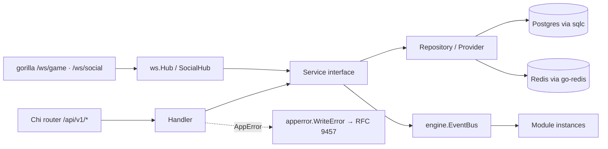
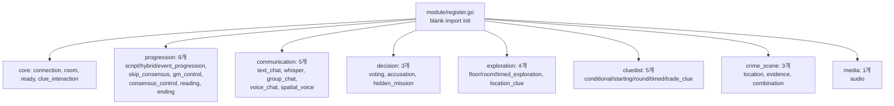

# 02. Backend (Go)

## 한 줄 요약 {#tldr}

단일 Go 1.25 바이너리 모놀리스. Chi HTTP 라우터 + gorilla/websocket + sqlc/pgx + go-redis. 3계층(Handler→Service→Repository) + 33 게임 모듈(Factory) + PlayerAware 보안 게이트 강제.

## 디렉토리 지도 {#layout}

> 출처: `apps/server/internal/` 직접 ls (2026-04-30 확인).

```
apps/server/
├── cmd/                        # main.go (UNVERIFIED 정확한 진입점 위치)
├── go.mod                      # Go 1.25, 50+ direct deps
├── Dockerfile                  # multi-stage, distroless 타깃
├── db/migrations/              # goose SQL (00001~00026)
├── internal/
│   ├── apperror/               # AppError + RFC 9457 + WriteError
│   ├── auditlog/               # 감사 로그 (00018, 00026 migration)
│   ├── bridge/                 # Audio EventBus 등 모듈간 브리지
│   ├── clue/                   # 단서 도메인 (Phase 20 통합 clue_edge_groups)
│   ├── config/                 # 환경변수 로딩 (env leak 방지: t.Setenv)
│   ├── db/                     # sqlc 생성 코드 (*.sql.go) + models.go
│   ├── domain/                 # 13 도메인 패키지 (#domains)
│   ├── e2e/                    # E2E 테스트 헬퍼 (서버 측)
│   ├── engine/                 # 게임 엔진 코어 (#engine)
│   ├── eventbus/               # 모듈간 비동기 메시지 (전역 설치 위치)
│   ├── health/                 # /healthz, /readyz
│   ├── httputil/               # WrapHandler (func(w,r) error 자동화)
│   ├── infra/                  # S3, Redis client 초기화 등 인프라 어댑터
│   ├── middleware/             # 인증·트레이싱·로깅·CORS
│   ├── module/                 # 33 게임 모듈 (#modules)
│   ├── seo/                    # 정적 메타·sitemap
│   ├── server/                 # 라우터 조립·HTTP 서버 부트스트랩
│   ├── session/                # 게임 세션 라이프사이클
│   ├── template/               # 테마 템플릿 핸들러
│   └── ws/                     # WebSocket Hub·envelope catalog (#ws)
```

## 계층 (Handler → Service → Repository) {#layers}

> 출처: `apps/server/CLAUDE.md`, `memory/project_coding_rules.md`.



- **Handler** (`internal/domain/<x>/handler.go` + `internal/server/`): HTTP I/O, validation 진입점, `httputil.WrapHandler`로 `func(w,r) error` 처리.
- **Service** (`internal/domain/<x>/service.go`): 인터페이스 정의 + 구현. mockgen 대상.
- **Repository / Provider** (`internal/domain/<x>/repo.go` + `internal/db/*.sql.go`): sqlc 생성 코드 호출. SQL→타입 자동 생성, 제로 오버헤드.
- **DI**: 생성자 주입(수동). 프레임워크 없음.
- **에러**: `apperror.AppError` + `WriteError` → RFC 9457 Problem Details. prod에선 5xx detail 마스킹, dev엔 debug info 포함. Sentry 자동 캡처(5xx만), OTel trace_id 응답 헤더에 포함.
- **로깅**: `zerolog`만 사용. `log.Println` / `fmt.Println` 금지.

## 도메인 패키지 (13) {#domains}

> 위치: `internal/domain/`. 각각 `handler.go` + `service.go` + `repo.go` 패턴 (변형 있을 수 있음).

| 도메인 | 책임 | 비고 |
|---|---|---|
| `admin` | 관리자 페이지 (테마 심사, 정산, 매출, 코인 그랜트) | UI: `pages/Admin*Page.tsx` |
| `auth` | JWT 발급, 패스워드 인증, OAuth | migration 00009 password_auth |
| `coin` | 코인 잔액·거래 | 결제 시스템과 연동 |
| `creator` | 크리에이터 대시보드 (테마 통계, 정산) | UI: `Creator*Page.tsx` |
| `editor` | 테마 에디터 (저장·불러오기·심사 워크플로우) | migration 00011, 00019 |
| `flow` | 게임 흐름(분기·엔딩·조건빌더) — Phase 17 이식, Phase 20 정식 | migration 00021 |
| `payment` | 결제 (코인 충전) | migration 00008 |
| `profile` | 사용자 프로필 (공개·비공개) | UI: `Profile*Page.tsx` |
| `room` | 로비/대기방 | migration 00004 |
| `social` | 친구·DM·차단·Presence | SocialHub 사용 (05-realtime.md) |
| `sound` | 사운드 메타데이터 (BGM/SFX 관리) | Audio 모듈과 다름 — 메타 vs 재생 트리거 |
| `theme` | 테마(시나리오) CRUD·미디어 | migration 00003, 00010, 00015 |
| `voice` | LiveKit 토큰 발급·룸 관리 | livekit-server-sdk-go v2.16.1 |

## 게임 엔진 (`internal/engine/`) {#engine}

> 출처: `apps/server/internal/engine/` ls + `memory/project_module_system.md`.

핵심 타입·파일:

| 파일 | 책임 |
|---|---|
| `phase_engine.go` | `GameProgressionEngine` — 3 Strategy(Script/Hybrid/Event) 디스패치 |
| `registry.go` | 모듈 등록·boot. **PlayerAware 게이트 panic 지점** |
| `factory.go` | 세션별 Module 인스턴스 생성 (싱글턴 금지) |
| `eventbus.go` / `event_bus.go` | 모듈간 비동기 메시지 |
| `module_types.go` / `module_optional.go` | `Module` / `PhaseReactor` / `PlayerAwareModule` / `PublicStateModule` 인터페이스 |
| `build_state_for_test.go` / `playeraware_helpers.go` | `BuildStateFor(playerID)` redaction 헬퍼 |
| `rule_evaluator.go` | 조건빌더 평가 (`diegoholiveira/jsonlogic` 기반) |
| `gate_test.go` | PlayerAware 게이트 통과 검증 |

### PlayerAware 게이트 (보안 critical) {#playeraware}

모든 `engine.Module`은 둘 중 하나 충족 — **registry boot 시점 panic으로 강제** (escape hatch 없음, F-sec-2):

1. `PlayerAwareModule.BuildStateFor(playerID)` 구현 → 플레이어별 redacted 상태 반환
2. `engine.PublicStateMarker` 임베드 → `PublicStateModule` 명시적 opt-out (전체 공개)

> 추가: PR-2c #107(Phase 19 P0)에서 `combination` 모듈 per-player redaction 추가, 그 직후 `handleCombine` deadlock 발견 → hotfix #108. 4-agent 리뷰 admin-merge 전 강제는 이 사고 이후 정책화 (`memory/feedback_4agent_review_before_admin_merge.md`).

## 게임 모듈 (33개, 8 카테고리) {#modules}

> 위치: `internal/module/<category>/<module>.go`. 등록은 `internal/module/register.go` blank import.



- **선언 4-pillar**: BaseModule + ConfigSchema + PhaseReactor(선택) + Factory.
- **PhaseAction 12종**: `configJson.phases`에서 선언적 정의. `PLAY_SOUND/PLAY_MEDIA/SET_BGM/STOP_AUDIO`는 Audio 모듈이 EventBus로 브리지.
- **혼동 주의**: `LocationClueModule`(#24, exploration) ≠ `LocationModule`(#30, crime_scene). 11-glossary 참조.
- **신규 모듈 추가 절차**: `.claude/skills/mmp-module-factory/SKILL.md` 체크리스트.

상세 스펙: `docs/plans/2026-04-05-rebuild/module-spec.md` (33 모듈 인덱스, 2026-04-19 갱신, PR #116).

## WebSocket 계층 (`internal/ws/`) {#ws}

> 별도 상세는 `05-realtime.md` 참조. 여기는 백엔드 코드 위치만.

| 파일 | 책임 |
|---|---|
| `hub.go` / `hub_broadcast.go` / `hub_lifecycle.go` | 게임 세션 Hub (sessionID 기반) |
| `client.go` | `ClientHub` 인터페이스 — 게임 Hub과 SocialHub 양쪽 동작 |
| `envelope_catalog_*.go` | C2S/S2C/Pending/System 메시지 타입 카탈로그 |
| `envelope_registry.go` | 메시지 타입 등록·디스패치 |
| `buffer.go` | 메시지 버퍼링 |
| `lifecycle.go` | 연결 수명주기 |
| (별도) `internal/domain/social/ws_handler.go` | SocialHub용 핸들러 |

## 인증·미들웨어 {#middleware}

- `internal/middleware/`: 인증·트레이싱·로깅·CORS·Recovery
- HTTP: `Authorization: Bearer <jwt>` 헤더
- WebSocket: **`?token=<jwt>` 쿼리 파라미터** (Authorization 헤더 안 됨 — `memory/feedback_ws_token_query.md`)
- Sentry middleware: 5xx 자동 캡처, BeforeSend로 Authorization/Cookie 필터
- OTel: 10% 샘플링, zerolog Hook으로 trace_id/span_id 자동 주입

## Go ↔ TS 타입 동기화 {#type-sync}

| 영역 | 방식 | 검증 |
|---|---|---|
| REST | Go → OpenAPI spec → openapi-typescript (TS) | CI |
| WebSocket | `packages/shared/ws/` (TS source of truth) → Go struct 수동 동기화 | CI 검증 |
| configJson | Zod(TS) + JSON Schema → Go struct | 에디터 자동 UI 렌더 근거 |

## 테스트 {#testing}

- **단위**: `*_test.go` 동일 디렉토리 (Go 컨벤션). table-driven 권장.
- **목**: `go.uber.org/mock v0.6.0` (mockgen). Service 인터페이스 단위.
- **통합**: `testcontainers-go v0.42.0` — 실제 Postgres/Redis 컨테이너.
- **커버리지 게이트**: 현재 enforcement 41%, 목표 75%+ (Phase 19.1 PR-B에서 lint AST 재작성 + 4 우회 패턴 차단).
- **PlayerAware 회귀 방지**: `PeerLeakAssert` helper 패키지 + 3+players table + Restore/engine dispatch 통합 테스트 (PR #113).

## 파일 크기 한도 {#size}

- 파일 500줄 / 함수 80줄 (table-driven 데이터 제외).
- 자동 생성(sqlc 생성물) 예외.
- 초과 예상 시: handler 분리 / service 인터페이스 쪼개기 / 모듈은 core+schema+factory+reactor.

## AI 설계 시 주의 {#design-notes-for-ai}

- 신규 모듈은 반드시 PlayerAware 게이트 충족. 임시 escape 없음.
- 신규 도메인 추가 시 `AppError.Wrap(err)` 패턴 사용. 새 에러 코드는 `apperror/codes.go` + `apps/web/src/lib/error-messages.ts` 동기화.
- Handler에서 직접 `*sql.DB` 호출 금지. 항상 Service 경유.
- WebSocket 새 메시지 타입은 `packages/shared/ws/`에 정의 후 Go envelope catalog 동기화. CI drift gate가 잡아냄.
- UNVERIFIED: `cmd/` 진입점 정확한 파일명·구조는 graphify 또는 직접 확인 필요.
