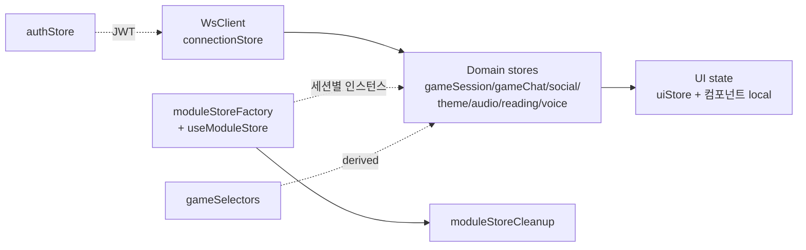

# 03. Frontend (React SPA)

## 한 줄 요약 {#tldr}

React 19 + Vite 6 SPA. Tailwind 4 직접 사용 + lucide-react 전용 + Zustand 5 (3-layer state). React Router 7 lazy loading. WS는 `packages/ws-client` 경유, REST는 services API 클라이언트. SSR 없음 (Cloudflare Pages 정적 배포 전제).

## 디렉토리 지도 {#layout}

> 출처: `apps/web/src/` 직접 ls (2026-04-30 확인).

```
apps/web/
├── src/
│   ├── App.tsx                 # 루트 라우터
│   ├── main.tsx                # 진입점 + ErrorBoundary 부트
│   ├── index.css               # Tailwind 4 directives
│   ├── pages/                  # 라우트 단위 (lazy)
│   ├── components/             # 재사용 컴포넌트
│   ├── features/               # 도메인 묶음 (UNVERIFIED 정확한 의미)
│   ├── hooks/                  # 커스텀 훅
│   ├── stores/                 # Zustand 스토어 (#stores)
│   ├── services/               # REST API 클라이언트 (#services)
│   ├── lib/                    # 횡단 유틸 (sentry, error-toast, error-messages)
│   ├── shared/                 # 공통 타입·상수
│   ├── utils/                  # 순수 헬퍼
│   └── mocks/                  # MSW handlers (test/dev)
├── e2e/                        # Playwright (12+ 시나리오)
├── eslint.config.js            # ESLint 9 flat config (Phase 18.3 PR-1 도입)
├── nginx.conf                  # prod SPA 서빙 + /api/*, /ws/* 리버스 프록시
└── package.json                # @mmp/web, deps는 07-tech-stack.md 참조
```

## 라우트 (pages/) {#pages}

> 출처: `apps/web/src/pages/` ls (20개 +).

| Page | 라우트 책임 | 비고 |
|---|---|---|
| `HomePage.tsx` | 메인 진입 | |
| `RoomPage.tsx` / `LobbyPage.tsx` | 대기방·로비 | |
| `GamePage.tsx` | 게임 진행 (WS 활성) | 모듈 store 다수 활성 |
| `EditorPage.tsx` | 테마 에디터 (React Flow 캔버스) | `@xyflow/react` |
| `MyThemesPage.tsx` | 내 테마 목록 | |
| `ProfilePage.tsx` / `PublicProfilePage.tsx` | 프로필 | |
| `Creator*Page.tsx` (4) | 크리에이터 대시보드·정산·통계 | |
| `Admin*Page.tsx` (5) | 관리자 (심사·정산·매출·코인 그랜트·패키지) | |
| `OfflinePage.tsx` | PWA offline | `vite-plugin-pwa` |
| `NotFoundPage.tsx` | 404 | |

> AI 주의: 신규 페이지 추가 시 `App.tsx` lazy import 등록. 컨벤션: `<Domain><Feature>Page.tsx`.

## 상태 (Zustand 3-layer) {#stores}

> 출처: `apps/web/src/stores/` ls.



| 스토어 | 레이어 | 책임 |
|---|---|---|
| `connectionStore` | Connection | WS 연결 상태·재접속 |
| `authStore` | Connection | JWT, 로그인 상태 |
| `gameSessionStore` | Domain | 현재 세션 메타 |
| `gameChatStore` | Domain | 게임 내 채팅 |
| `socialStore` | Domain | 친구·DM·Presence |
| `themeStore` | Domain | 테마 데이터 (에디터/플레이어 공용) |
| `audioStore` | Domain | 재생 큐·BGM 상태 |
| `readingStore` | Domain | 리딩 섹션 진행 |
| `voiceStore` | Domain | LiveKit 룸 상태 |
| `moduleStoreFactory` + `useModuleStore` | Domain | **세션별 인스턴스** — 백엔드 모듈 Factory와 대칭 |
| `moduleStoreCleanup` | Domain | 세션 종료 시 정리 |
| `gameSelectors` | Domain | 파생 상태 (derived) |
| `uiStore` | UI | 모달·토스트 등 |

> AI 주의: 모든 도메인 스토어는 `useStore()` hook 단위. 컴포넌트 local state는 UI에만 한정. WS 메시지를 직접 컴포넌트에서 구독 금지 — 항상 Connection→Domain 경유.

## API 클라이언트 (services/) {#services}

> 출처: `apps/web/src/services/` ls.

| 파일 | 책임 |
|---|---|
| `api.ts` | 기본 fetch wrapper. `ApiHttpError` 분리, 네트워크 에러(`status=0`, `NETWORK_ERROR`), 조건부 Content-Type |
| `profileApi.ts` | 프로필 도메인 |
| `voiceApi.ts` | LiveKit 토큰 발급 |
| `queryClient.ts` | `@tanstack/react-query` QueryClient |

> 패턴: 도메인별 `<domain>Api.ts` 분리. 글로벌 CLAUDE.md의 "BaseAPI 상속" 룰은 글로벌 룰이지만 이 프로젝트는 fetch wrapper 직접 사용 — UNVERIFIED 패턴 일관성, 신규 도메인 추가 시 기존 `*Api.ts` 패턴 참조.

## 에러 처리 {#errors}

> 출처: `memory/project_error_system.md`, `apps/web/src/lib/`.

| 파일 | 역할 |
|---|---|
| `lib/api-error.ts` | `ApiHttpError extends Error` (Object.setPrototypeOf 안전) |
| `lib/error-messages.ts` | 22+ 에러 코드 → 한국어 메시지. `{key}` params 치환 |
| `lib/show-error-toast.ts` | sonner 토스트 — 4xx 5초, 5xx 수동닫기 + trace ref, 401 리다이렉트 (루프 방지) |
| `lib/global-error-handler.ts` | `unhandledrejection` + chunk loading 실패 감지. prod에서 raw 메시지 미노출 |
| `lib/sentry.ts` | `@sentry/react` 초기화. replay PII 마스킹(maskAllText + maskAllInputs + blockAllMedia) |

**ErrorBoundary 3계층** (`react-error-boundary` v6):
- Global (앱 크래시) → Page (라우트 단위) → Component (부분 실패)

## 스타일·아이콘 {#style}

- **Tailwind 4 직접 사용** (`@tailwindcss/vite` 플러그인). 글로벌 CLAUDE.md의 Seed Design 3단계 룰은 **이 프로젝트만 예외** (`apps/web/CLAUDE.md` 명시).
- **다크 모드 기본** (slate/zinc + amber 팔레트).
- **lucide-react 전용** — 다른 아이콘 라이브러리 금지.
- 디자인 토큰: `packages/ui-tokens` (workspace 의존성, 직접 Tailwind config로 import).

## WebSocket 클라이언트 {#ws-client}

- `packages/ws-client` 사용. **직접 `new WebSocket()` 금지**.
- 토큰: `?token=<jwt>` 쿼리 (헤더 아님 — 브라우저 WS는 헤더 미지원).
- 재접속: exponential backoff + auth.resume (PR-9 Phase 19 Residual W4 예정).
- 두 개 채널: `/ws/game` (게임), `/ws/social` (친구·DM·presence). 별개 SocialHub.

## 라우팅 패턴 {#routing}

- `react-router` v7 (lazy loading 기본).
- 인증 가드: `authStore` 기반. UNVERIFIED 정확한 가드 컴포넌트 위치.
- 페이지 코드 스플리팅 — `lazy(() => import('./pages/...'))`.

## 테스트 {#testing}

- **단위·컴포넌트**: Vitest + Testing Library + MSW. 위치 `*.test.tsx` co-located.
- **커버리지 게이트**: Lines 49% / Branches 77% / Functions 53%. 목표 75%+ (Phase 21).
- **E2E**: Playwright (`apps/web/e2e/`). chromium + firefox shard. 백엔드 없으면 로비 플로우 자동 스킵.
- **접근성**: `@axe-core/playwright` — focus-visible / WCAG 2.1 AA smoke (Phase 19 Residual H-2 진행).

## 파일 크기 한도 {#size}

- `.ts` / `.tsx` 400줄 / 함수 60줄 / JSX 컴포넌트 150줄.
- 초과 예상 시: 서브컴포넌트 추출 / hooks 개별 파일 + 배럴 / api 도메인별 파일 + 배럴.

## 빌드 {#build}

```bash
pnpm --filter @mmp/web build
# = tsc --noEmit && vite build
# pretest/pretypecheck/pretest:e2e 가 ws-client 의존 빌드 자동 트리거
```

- 산출물: `apps/web/dist/`
- prod: nginx 컨테이너가 `dist/` 서빙 + `/api/*`·`/ws/*` 리버스 프록시
- PWA: `vite-plugin-pwa` (offline shell)

## AI 설계 시 주의 {#design-notes-for-ai}

- 신규 페이지 → lazy import + 라우터 등록 + 도메인 스토어 1개 (필요 시). UI 상태는 컴포넌트 local로 충분.
- 신규 WS 메시지 타입 → `packages/shared/ws/` 정의 → connectionStore 디스패치 → Domain store 반영. CI drift gate가 미동기화 잡아냄.
- 신규 에러 코드 → 백엔드 `apperror/codes.go` + 프론트 `lib/error-messages.ts` 동시 추가.
- Tailwind 클래스 인라인이 기본. CSS module은 사용 안 함.
- 컴포넌트 분할 한계: JSX 150줄 초과 시 서브컴포넌트로.
- UNVERIFIED: `features/` vs `components/` 분리 규칙 — 직접 read 또는 graphify로 확인 필요.
