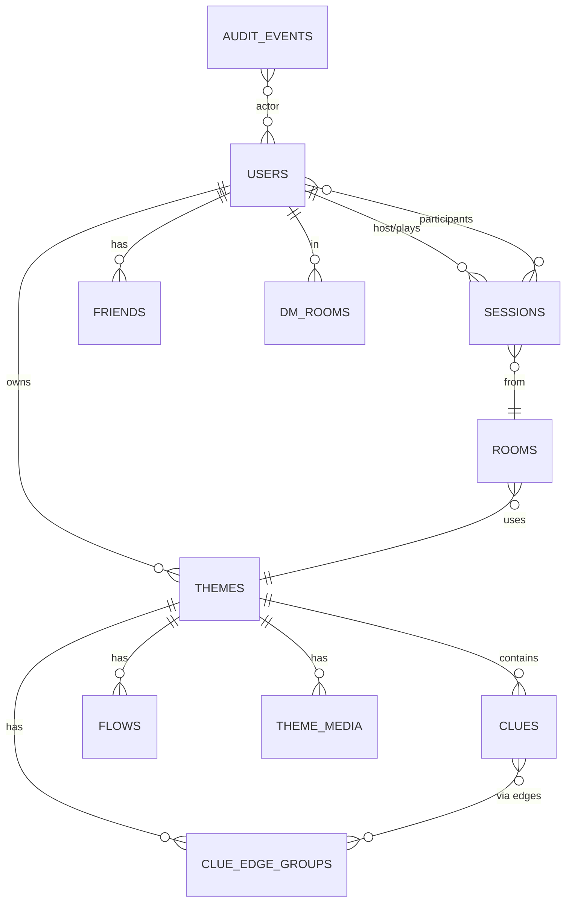

# 04. Data Layer (Postgres + Redis)

## 한 줄 요약 {#tldr}

PostgreSQL 17이 단일 영구 저장소. Redis 7이 휘발성·실시간(Presence/Pub-Sub/캐시). sqlc로 SQL→Go 타입 자동 생성, pgx 드라이버. goose migration (00001~00026). Phase 20에서 단서 그래프를 통합 `clue_edge_groups` 스키마로 정리.

## Migration 시퀀스 {#migrations}

> 출처: `apps/server/db/migrations/` ls (2026-04-30, 26개 파일).

| # | 파일 | 핵심 |
|---|---|---|
| 00001 | `init_extensions.sql` | uuid-ossp 등 |
| 00002 | `users.sql` | 사용자 테이블 |
| 00003 | `themes.sql` | 테마(시나리오) |
| 00004 | `rooms.sql` | 대기방·세션 진입 |
| 00005 | `sessions.sql` | 게임 세션 |
| 00006 | `review_fixes.sql` | 리뷰(테마 심사) 보정 |
| 00007 | `social.sql` | 친구·DM 룸·메시지 |
| 00008 | `payment.sql` | 결제 (코인 충전) |
| 00009 | `password_auth.sql` | 패스워드 인증 |
| 00010 | `themes_coin_price.sql` | 테마 코인 가격 |
| 00011 | `editor_tables.sql` | 에디터 저장 구조 |
| 00012 | `notification_preferences.sql` | 알림 설정 |
| 00013 | `users_soft_delete.sql` | soft delete (deleted_at) |
| 00014 | `social_enhancements.sql` | role, metadata, deleted_at, IMAGE 타입 |
| 00015 | `theme_media.sql` | 테마 미디어 첨부 |
| 00016 | `reading_sections.sql` | 리딩 섹션 |
| 00017 | `media_type_video.sql` | 비디오 타입 추가 |
| 00018 | `audit_events.sql` | 감사 이벤트 |
| 00019 | `editor_review_workflow.sql` | 테마 심사 워크플로우 |
| 00020 | `clue_items.sql` | **단서 아이템** (Phase 11/20) |
| 00021 | `flow_tables.sql` | 흐름 (분기·엔딩) |
| 00022 | `clue_relations.sql` | 단서 관계 (Phase 17.5 DAG) |
| 00023 | `remove_clue_type.sql` | 단서 타입 정리 |
| 00024 | `unified_clue_edges.sql` | **통합 `clue_edge_groups`** (Phase 20 핵심) |
| 00025 | `round_schedule.sql` | 라운드 스케줄 |
| 00026 | `auditlog_expansion.sql` | 감사 로그 확장 |

> AI 주의: 새 migration 번호는 `00027_*.sql`. 작성 시 `goose -- +goose Up` / `+goose Down` 헤더 필수. 외래키·CHECK 제약 변경은 6전문가 토론 절차 (`memory/feedback_migration_workflow.md`).

## sqlc 생성 코드 (`internal/db/`) {#sqlc}

> 출처: `apps/server/internal/db/` ls (각 도메인별 `*.sql.go` + 공통 `db.go`, `models.go`).

| 파일 | 도메인 |
|---|---|
| `models.go` | 전체 model 구조체 |
| `db.go` | Querier 인터페이스·DB 핸들 |
| `users.sql.go` | 사용자 |
| `themes.sql.go` | 테마 |
| `rooms.sql.go` | 대기방 |
| `sessions.sql.go` | 게임 세션 |
| `social.sql.go` | 친구·DM |
| `editor.sql.go` | 에디터 |
| `flow.sql.go` | 분기·엔딩 |
| `clue_edges.sql.go` | 통합 clue_edge_groups (Phase 20) |
| `coin.sql.go` | 코인 |
| `payment.sql.go` | 결제 |
| `creator.sql.go` | 크리에이터 |
| `media.sql.go` | 미디어 |
| `reading_sections.sql.go` | 리딩 섹션 |
| `notification_preferences.sql.go` | 알림 |
| `audit_events.sql.go` | 감사 이벤트 |
| `review.sql.go` | 테마 심사 |

> 모든 SQL 쿼리는 `apps/server/db/queries/<domain>.sql` (UNVERIFIED 정확한 경로) 에서 sqlc generate. handler/service는 절대 raw `*sql.DB` 사용 금지 — 항상 sqlc 생성 메서드 경유.

## 핵심 데이터 모델 (개념) {#er-overview}

- **Users → Themes**: 크리에이터 소유 관계 + 코인 가격 (00010).
- **Themes → Clues / Clue Edges (DAG)**: 단서·관계 그래프. Phase 17.5 DAG 도입 후 Phase 20에서 `clue_edge_groups` 통합 (CHECK 제약 9건 활성).
- **Themes → Flows**: 분기·엔딩 (Phase 17 이식, Phase 20 정식).
- **Sessions ↔ Users (M:N)**: 게임 참여자.
- **Audit Events**: 행위 추적 (00018, 00026 확장).

## 단서 그래프 통합 스키마 (Phase 20 핵심) {#clue-edge-groups}

> 출처: `apps/server/db/migrations/00024_unified_clue_edges.sql`, `internal/db/clue_edges.sql.go`, `memory/project_phase20_progress.md`.

- 이전: clue_relations (00022) — 페어 단위
- 이후 (00024): `clue_edge_groups` — 그룹 단위 통합 (AUTO/CRAFT 단서, CurrentRound, 라운드 필터, CHECK 제약 9건)
- 라운드 왕복 QA 7/7 통과 (스테이징 DB 00020~00025 적용)
- AUTO: 라운드 진입 시 자동 부여 / CRAFT: 조합으로 생성

## 외래키·CHECK 제약 패턴 {#constraints}

> AI 주의: 단서 그래프 수정 시 CHECK 제약 9건 깨지지 않게 확인. 정확한 SQL은 migration 00024 직접 read.

- soft delete: `users.deleted_at` (00013)
- 감사: `audit_events` 트리거(가능성 — UNVERIFIED) + 핸들러 명시 호출
- 비밀정보 저장 금지: voice token, password (해시만), OAuth secret

## Redis 사용처 {#redis}

> 출처: `memory/project_social_system.md`, `internal/domain/social/presence.go`, `internal/infra/`.

| 키 패턴 | 용도 | TTL |
|---|---|---|
| `presence:user:<userID>` | Presence (online 표시) — SETEX | 90s (heartbeat 60s) |
| `social:dm:<roomID>:unread:<userID>` (UNVERIFIED) | 안읽음 카운트 | — |
| `session:<sessionID>:state` (UNVERIFIED 정확한 키) | 게임 세션 휘발성 상태 | 세션 종료 시 |
| `module:<sessionID>:<moduleID>` (UNVERIFIED) | 모듈 인스턴스 캐시 | 세션 종료 시 |
| `ratelimit:*` (UNVERIFIED) | API 레이트 리밋 | — |

> 정확한 키 네이밍·TTL은 `internal/infra/redis*.go` 또는 `internal/domain/social/presence.go` 직접 read.

### Presence 동작
- 클라가 `presence:heartbeat` WS 메시지를 60초마다 전송
- 서버: Redis SETEX 90초 갱신
- 서버 크래시 → 90초 후 자동 offline 전환

### 사용자당 WS 연결 1개 강제
- 새 연결 진입 시 기존 연결 자동 정리 (`memory/project_social_system.md`)
- Redis 통한 다중 인스턴스 라우팅은 UNVERIFIED — 현재 단일 server pod 가정

## S3 (이미지 업로드) {#s3}

- `aws-sdk-go-v2/service/s3 v1.98.0`
- 테마 커버 이미지·크롭 결과·미디어 첨부 (00015, 00017)
- 클라이언트: `react-image-crop` / `react-easy-crop`
- 서버: presigned URL 발급 (UNVERIFIED 정확한 핸들러 위치 — `internal/infra/` 또는 `internal/domain/theme/`)

## 백업·복구 {#backup}

- UNVERIFIED 정확한 정책. dev compose는 휘발성. prod K8s 1 Deployment 배포 정책 미수립 시점 (직접 확인 필요).

## AI 설계 시 주의 {#design-notes-for-ai}

- **schema drift 위험**: TS↔Go↔SQL 3-way. 새 컬럼은 migration → sqlc generate → Go struct → OpenAPI(REST) / shared/ws(WS) 동시 갱신.
- **단서 그래프 수정**: `clue_edge_groups` 통합 후 분리/우회 금지. CHECK 제약 9건 위반 시 staging QA에서 잡힘.
- **새 도메인**: migration → queries SQL 작성 → `sqlc generate` → handler/service/repo 트리오.
- **Redis 키**: 새 도메인은 prefix 정합성 (`<domain>:<entity>:<id>`) 유지. TTL 명시.
- **마이그레이션 down 함수**: 항상 작성 (rollback 가능). 외래키 변경은 6전문가 토론 절차 강제.
- UNVERIFIED 항목들은 graphify cluster 또는 직접 read로 확정 후 doc 갱신.
