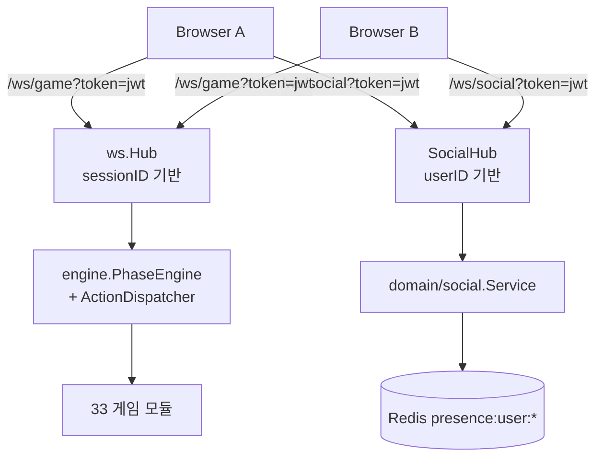
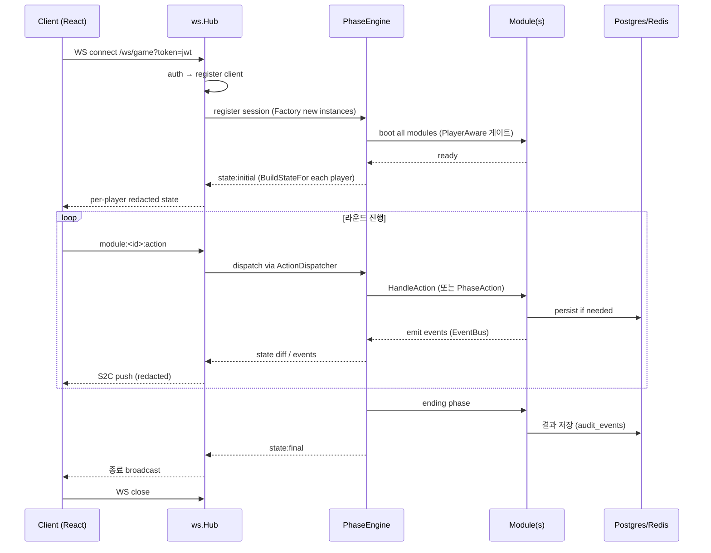

# 05. Realtime (WebSocket + Modules)

## 한 줄 요약 {#tldr}

두 개의 WS 채널 — `/ws/game` (sessionID 기반 Hub) vs `/ws/social` (userID 기반 SocialHub). gorilla/websocket. `?token=` 쿼리 인증. 메시지는 envelope catalog 4종(c2s/s2c/pending/system)으로 카탈로그화. 33 게임 모듈은 PhaseAction을 EventBus 통해 받아 처리, PlayerAware 게이트로 per-player redaction 강제.

## 채널 분리 {#channels}

| 채널 | Hub | 키 | 클라이언트 사용 |
|---|---|---|---|
| `/ws/game` | `internal/ws.Hub` | sessionID | 게임 진행 중에만 |
| `/ws/social` | `internal/ws.SocialHub` (`internal/domain/social/`) | userID | 로그인 후 상시 |

> 절대 혼용 금지. 게임 메시지를 social 채널로 보내거나 그 반대 금지.

## 인증 {#auth}

- **WS 토큰은 `?token=<jwt>` 쿼리 파라미터** (Authorization 헤더 ❌ — 브라우저 WS는 헤더 미지원).
- 출처: `memory/feedback_ws_token_query.md`.
- prod: JWT (`internal/domain/auth/`).
- dev: `?player_id=` fallback 허용 (테스트용).
- **사용자당 WS 연결 1개 강제** — 새 연결 진입 시 기존 연결 자동 정리.

## Envelope Catalog {#envelopes}

> 출처: `apps/server/internal/ws/envelope_catalog_*.go` (4개 파일 + registry).

| 카테고리 | 파일 | 방향 | 용도 |
|---|---|---|---|
| **C2S** | `envelope_catalog_c2s.go` | Client → Server | 사용자 액션 (action 발사, chat:send 등) |
| **S2C** | `envelope_catalog_s2c.go` | Server → Client | 상태 push, broadcast |
| **Pending** | `envelope_catalog_pending.go` | 양방향 (지연 전달) | 재접속 후 미처리 메시지 |
| **System** | `envelope_catalog_system.go` | Server → Client | 시스템 메시지 (auth.resume, error 등) |

- 등록·디스패치: `envelope_registry.go`
- 버퍼링: `buffer.go`
- 수명주기: `lifecycle.go`, `hub_lifecycle.go`

## 메시지 타입 (소셜 채널) {#social-messages}

> 출처: `memory/project_social_system.md`.

| Type | 방향 | 설명 |
|---|---|---|
| `chat:send` | C→S | DM 메시지 전송 |
| `chat:typing` | C→S | 타이핑 상태 |
| `chat:read` | C→S | 읽음 처리 |
| `chat:message` | S→C | 실시간 push |
| `chat:typing_indicator` | S→C | 상대 타이핑 푸시 |
| `chat:read_receipt` | S→C | 읽음 영수증 |
| `friend:request` | S→C | 친구 요청 |
| `friend:accepted` | S→C | 친구 수락 |
| `friend:online` / `friend:offline` | S→C | 상태 변경 |
| `presence:heartbeat` | C→S | 60초마다 — Redis SETEX 90s 갱신 |

## 메시지 타입 (게임 채널) {#game-messages}

> 정확한 카탈로그는 `internal/ws/envelope_catalog_*.go` 직접 read 또는 `packages/shared/ws/` (TS source of truth) 참조.

흐름 패턴 (개념):
- C2S: `module:<moduleID>:action` (액션 디스패치)
- S2C: `state:<scope>` (per-player redacted state push), `module:<moduleID>:event`
- System: `auth.resume`, `error`

## 게임 시퀀스 (시작 → 진행 → 종료) {#game-sequence}

## PhaseAction (12종) {#phase-actions}

> 출처: `memory/project_module_system.md`. 정확한 12종 enum은 `internal/engine/module_types.go` 또는 `packages/shared/`에서 확인 권장.

- 모듈은 `configJson.phases` 에서 선언적으로 PhaseAction 시퀀스 정의.
- 미디어 관련 (`PLAY_SOUND`, `PLAY_MEDIA`, `SET_BGM`, `STOP_AUDIO`) 4종은 Audio 모듈이 EventBus로 브리지.
- 다른 모듈은 PhaseReactor 인터페이스 구현 시 `OnPhaseAction(action)` 받음.

## PlayerAware 게이트 (보안 critical 재강조) {#playeraware}

> 02-backend.md `#playeraware` 와 동일 정책 — 여기는 실시간 흐름 관점.

- 매 push마다 서버는 `BuildStateFor(playerID)` 호출 → playerID별 redacted 객체
- `PublicStateMarker` 임베드 모듈은 redaction 없이 전체 공개 (명시적 opt-out)
- registry boot 시점 panic으로 미준수 모듈 차단 (escape hatch 없음)
- 회귀 방지: `PeerLeakAssert` helper + 3+players table + Restore/engine dispatch 통합 테스트 (PR #113)

### PR-2c #107 deadlock 사고 (2026-04-18) — 재발 방지 카논
- combination 모듈 per-player redaction 추가 도중 `handleCombine` deadlock 발견
- hotfix #108 + 4-agent 리뷰 admin-merge 전 강제 (`memory/feedback_4agent_review_before_admin_merge.md`)
- 신규 모듈/기능 추가 시 동시성·뮤텍스 패턴 4-agent 리뷰 의무

## 재접속 + auth.resume {#reconnect}

- 클라: `packages/ws-client` exponential backoff
- 서버: pending envelope 카탈로그로 재전송
- **PR-9 (Phase 19 Residual W4) 예정**: WS Auth Protocol 강화 + auth.resume 확정 — 09-issues-debt.md 참조

## SocialHub 핵심 연산 {#social-hub-ops}

> 출처: `apps/server/internal/ws/social_hub.go` (UNVERIFIED 파일명) + `internal/domain/social/`.

| 연산 | 설명 |
|---|---|
| `JoinRoom(userID, roomID)` | DM 룸 참여 |
| `BroadcastToRoom(roomID, msg)` | 룸 멤버 푸시 |
| `SendToUser(userID, msg)` | 단일 사용자 직송 |
| `차단 필터링` | `service.go` SendMessage / GetOrCreateDMRoom — `ErrChatBlocked` |

## 신규 WS 기능 추가 절차 {#add-ws-feature}

1. `packages/shared/ws/` 에 메시지 타입 + 페이로드 (TS source of truth) 정의
2. Go envelope catalog 4종 중 적절한 위치에 동기화 추가
3. CI drift gate (Phase 18.7 도입) 가 미동기화 잡아냄 — 통과 확인
4. 게임 채널이면: 모듈에 `HandleAction` / `PhaseReactor` 추가. PlayerAware 게이트 충족 확인.
5. 소셜 채널이면: `domain/social/ws_handler.go` 핸들러 추가 + 차단 필터링 검토.
6. 프론트 connectionStore 디스패치 추가 → Domain store 반영.
7. E2E 테스트 (Playwright `apps/web/e2e/`) 시나리오 추가.

## 신규 모듈 추가 절차 {#add-module}

1. 카테고리 결정 — 8개 중 (core/progression/communication/decision/exploration/cluedist/crime_scene/media)
2. `internal/module/<category>/<module>.go` 생성 — BaseModule 임베드, ConfigSchema 선언, Factory
3. PhaseReactor 필요하면 인터페이스 구현
4. **PlayerAware 게이트 충족** — `BuildStateFor` 또는 `PublicStateMarker` 둘 중 하나
5. `internal/module/register.go` blank import 추가
6. ConfigSchema TS 측 (Zod) 동기화 — 에디터 자동 UI 렌더에 사용
7. `.claude/skills/mmp-module-factory/SKILL.md` 체크리스트 통과
8. 단위 + 통합 테스트 작성 (PeerLeakAssert helper 사용)
9. 4-agent 리뷰 (security/perf/arch/test) admin-merge 전 강제

## AI 설계 시 주의 {#design-notes-for-ai}

- **redaction 누락 = 보안 critical**: 새 모듈/필드 추가 시 BuildStateFor에 명시적으로 어떤 필드가 어떤 플레이어에게 노출되는지 결정.
- **deadlock 위험**: 동시성 코드 추가 시 Mutex 순서·범위 4-agent 리뷰 의무.
- **WS payload 검증**: PR-10 (Phase 19 Residual W4 예정) Runtime Payload Validation 도입 전까지 핸들러에서 명시적 검증.
- **재접속 idempotency**: 클라가 같은 액션을 재발송할 수 있으니 핸들러는 idempotent 설계.
- UNVERIFIED 항목 (정확한 enum, 소셜 핸들러 파일명 등)은 직접 read로 확정.
